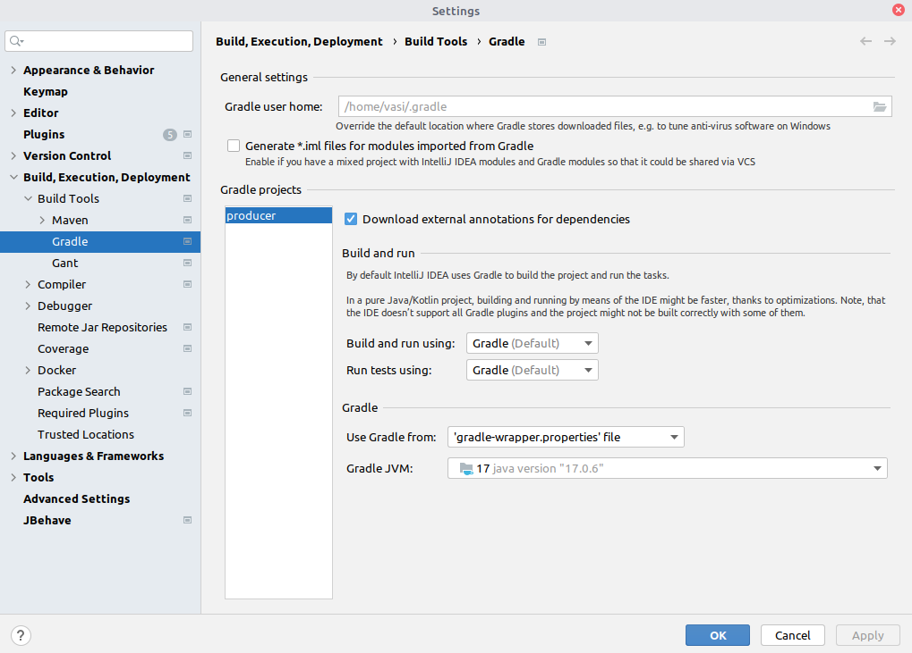

Для установки нужной версии в Idea установил версию Settings->Build,Execution,Deployment->Build Tools->Gradle->

(https://stackoverflow.com/questions/72117858/incompatible-because-this-component-declares-a-component-compatible-with-java-11)

Java 11
------------------------
vasi@vasi-note:~/prog/java/kafka/kafka-cluster/dto$ export JAVA_HOME=/usr/lib/jvm/java-11-openjdk-amd64/
vasi@vasi-note:~/prog/java/kafka/kafka-cluster/dto$ ./gradlew build

BUILD SUCCESSFUL in 2s
2 actionable tasks: 2 executed
